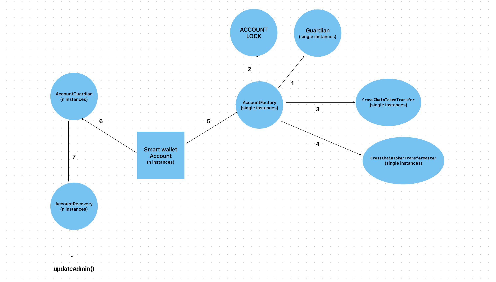

<h1 align="center">CryptoPhoenix Smart Wallet Contracts</h1>

CryptoPhoenix Wallet SDK is a rollup to thirdweb's smart wallet contracts and offers:  
<ol>
<li>Social Account Locking</li>
<li>Social Account Recovery</li>
<li>Guardian Management</li>
</ol>

## Problem Statement
As we all know, a wallet is a gateway to web3 but the wallet experience is unfortunately broken! For a user to interact with a blockchain, they not only have to **create a wallet but also secure their private keys and seed phrase, purchase native tokes to pay for gas, and sign every single action** that they take on a dApp. 

Such an intimidating user experience for newcomers is a big obstacle in the mass adoption of web3 and CryptoPhoenix Wallet SDK is here to change this through its **Account abstraction technology.

## Smart Wallets (ERC 4337)
Smart wallets are wallets that are controlled by programmable smart contract therefore having the following key benefits:
1. **Improved user experience:**
   Eliminates the need to manage private keys, making it easier and safer for users to interact with Web3.
Enable gasless transactions for your users.
Enable batched transactions, preventing user from having to approve every single transaction.
Enables features like social recovery and multi-signature wallets.
Allows for programmable payments and recurring subscriptions.
Enhanced security:
Reduces the risk of losing funds due to private key theft.
Smart contracts can be programmed with additional security features.
Increased flexibility:
Enables new types of wallets and applications.
Allows for more complex financial transactions.
Reduced transaction costs:
Can batch multiple transactions into one, saving gas fees.
Greater scalability:
Can improve the overall performance of blockchain networks.
They follow ERC-4337, a new ‘account abstraction’ standard that unlocks the power of smart contract wallets, or ‘smart accounts,’ on the Ethereum blockchain (and EVM-compatible networks). 
## Architecture

 
 

[**Architecture walkthrough**](https://www.youtube.com/embed/0zq2YdOYFUo)

## Smart wallets
Smart wallets are wallets that are controlled by a smart contract and have the following key benefits-
<ol>
<li>
<h4>Abstracted user experience: </h4>
Eliminates the need to manage private keys or seed phrase, making it easier and safer for users to experience Dapps.
</li>
<li>
<h4>Enable gasless transactions:</h4>
Dapps providing smart account can sponser gas on behalf of their users therefore reducing investment to entry and drastically improving user experience as users now don't have to approve each transaction they make with the Dapp.
</li>
<li> 
<h4>Enhanced security through account locking, social recovery and multisig: </h4>
In case the user lose access to their wallet, they can immediately lock their account assets, holding all withdrawal transactions, and can even recover access to their accounts through concensus of their account guardians (trusted people who the user allots to help recover their account in case required).  
Smart accounts can also provide multisig capabilities, requiring multiple signatures on a transaction, before it's executed, thus enchancing security.

<li><h4>Automation of transactions</h4>
Enables self executing transactions when certain defined conditions are met like approving a predefined number of tokens to an entity based on fixed time intervals, stop loss and take profit orders, recurring subscriptions, etc.
</li>

## How we built it
The wallet SDK is a rollup to thirdweb's smart wallet (ERC-4337) contracts. We've added the following contracts to extend it's functionality:
<li> AccountGuardian.sol: Used to assign guardians for smart wallet accounts. </li>
<li> Guardian.sol: Powers the guardian interactions, like attending to account lock & recovery requests. </li>
<li> AccountLock.sol: Adds features like creating and evaluating account lock requests and locking the account assets, if consensus is achieved. </li>
<li> AccountRecovery.sol: Offers the ability to back up account's private key shards, create and evaluate account recovery requests and help with account recovery overall. </li>
<li> CrossChainTokenTransfer.sol: Provides creation of Chainlink's CCIP transfer request, signature verification, and finally implementation according to the ERC-4337 standards. </li>

## Documentation 

[CryptoPhoenix Smart Wallet Contract Docs](https://chukwunonsos-personal-organizati.gitbook.io/cryptophoenix/)

## Authors

- [Shiven](https://github.com/alfheimrShiven)
- [William](https://github.com/techyNonso)

## License

[Apache 2.0](https://www.apache.org/licenses/LICENSE-2.0.txt)
